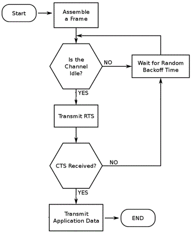
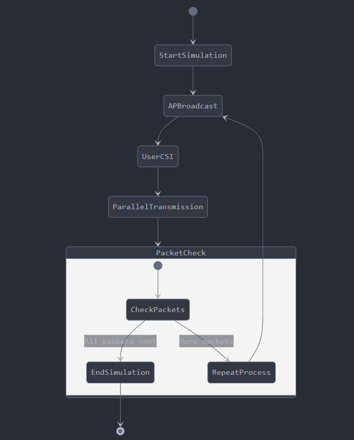

# Modeling and Simulation of WiFi Communication

## Objective
The goal of this project is to simulate WiFi 4 Communication (CSMA/CA), WiFi 5 Communication (MU-MIMO), and WiFi 6 Communication (OFDMA). The simulation models communication between multiple users and an Access Point (AP), including processes like packet transmission, backoff time handling, and interference resolution. The simulation calculates throughput, latency, and maximum latency for different scenarios and provides insights into how the protocols perform under various network conditions.

## Approach

- **WiFi 4 Simulation (CSMA/CA)**

  In WiFi 4, communication happens via a single AP and a set of users. CSMA/CA is used to determine if the channel is idle or busy before transmitting a packet. If the channel is busy, the transmission is deferred by a random backoff time with collision detection and handling, which is recalculated each time the channel is accessed. The goal is to simulate multiple users and compute throughput and latency metrics.

- **WiFi 5 Simulation (MU-MIMO)** 

  WiFi 5 introduces multi-user MIMO (MU-MIMO), where parallel transmissions can occur after the AP broadcasts a packet and each user sends their channel state information (CSI). After sending the CSI, users can communicate in parallel for a time slot. The goal is to simulate multiple users, each transmitting a number of packets, and calculate throughput, average latency, and maximum latency for WiFi 5 communication.
  
- **WiFi 6 Simulation (OFDMA)**
  
  WiFi 6 (802.11ax) introduces **Orthogonal Frequency Division Multiple Access (OFDMA)**, a technique that subdivides the 20 MHz channel into smaller sub-channels (2 MHz, 4 MHz, or 10 MHz). Each sub-channel can be used for parallel transmissions over a 5 ms time slot. WiFi 6 supports greater efficiency and higher throughput by allowing multiple devices to transmit data in parallel. The simulation calculates throughput, average latency, and maximum latency, using round-robin scheduling of users across sub-channels.

## Explanation of Parameters and Assumptions:

- Global Parameters: These define the basic setup for the simulation, including the bandwidth, modulation scheme, packet size, transmission time, and data rate. These values are used throughout all the protocols.

- WiFi 4 Assumptions: These assumptions focus on the CSMA/CA mechanism, which handles the backoff time when multiple users compete for the channel.

- WiFi 5 Assumptions: These assumptions deal with the MU-MIMO mechanism, including the transmission time for CSI packets and the time slot for parallel communication.

- WiFi 6 Assumptions: These assumptions model OFDMA, where the available 20 MHz bandwidth is subdivided into smaller sub-channels that are used in parallel. Each user is assigned to a sub-channel in a round-robin fashion.


## Requirements

- **C++17** or higher
- **g++ compiler** (or any C++17 compatible compiler)
- **make** (optional, for building the project easily)

## Code Files

- **WiFi4Simulator.h / WiFi4Simulator.cpp**:
  
  Contains the simulation logic for WiFi 4 (CSMA/CA). It models users, access points, packet transmission, and backoff handling.

- **WiFi5Simulator.h / WiFi5Simulator.cpp**:
  
  Contains the simulation logic for WiFi 5 (MU-MIMO). It models users, AP broadcasting, CSI packet collection, and parallel data transmission.


- **Simulator.h / Simulator.cpp**:
  
  Abstract base class for simulation, handling shared functionality like throughput and latency calculations, and saving logs.

- **User.h / User.cpp**:
  
  Models the users in the simulation. Each user has properties like backoff time, transmission start and end times, and can transmit data.

- **Packet.h / Packet.cpp**:

  Models the packets in the simulation. It provides the structure for packet size and other related properties.

- **AccessPoint.h / AccessPoint.cpp**:
  
  Models the access point in the simulation. It handles broadcast packet transmissions and communication with users.

- **FrequencyChannel.h / FrequencyChannel.cpp**:
  
  Models the communication channel, handling interference and ensuring that packets are transmitted without collisions.

  ## How to Build and Run

### **Step 1: bash script files to create the directory and file structures**

use the setup.sh to create the directory and file structures:

```bash
./setup.sh
```
### **Step 2: Compile the Project**

Use the `Makefile` to build the project:

```bash
make debug
```
This will build the debug version of the project. You can also build the optimized version with:
```bash
make release
```
### **Step 3: Run the Program**

Run the program, For example:

```bash
./build/build/WiFiSimulator_debug.exe
```
It will ask for :
```bash
===============================================
        WiFi Simulation Program
===============================================
1. WiFi 4 (CSMA/CA)
2. WiFi 5 (MU-MIMO)
3. WiFi 6 (OFDMA)
4. Exit
===============================================
Enter your choice (1/2/3/4): 
```
- Now on choosing 1: 

This will ask for number of users and number of iterations to take average of.

- Now on choosing 2: 

This will ask for number of users and number of packets to be sent.

If there's a mistake, the program will display an appropriate message.

- Now on choosing 3: 

It will ask for number of users and then folloed by
```
--- WiFi 6 OFDMA Simulation ---
Enter sub-channel width (2, 4, or 10 MHz): 
```

### Note:
we are assuming that lower the user number higher the priority or we can say that particular user came first, we do this to resolve conflict between two or more users.

## OOPD Concepts Used

- **Encapsulation**: Data related to users, packets, and the access point is encapsulated in respective classes like `User`, `Packet`, `AccessPoint`, etc.
  
- **Inheritance**: The `Simulator` class is the base class,`WiFi4Simulator` is derived from it, reusing the common functionality.
  
- **Polymorphism**: The `runSimulation()` function is implemented differently for both WiFi 4 and WiFi 5, using the concept of polymorphism for overriding the base class methods.
  
- **Abstraction**: High-level concepts like packet transmission, backoff handling, and user communication are abstracted through appropriate class methods, making the system modular and easy to extend.

- **Composition**: The `WiFi4Simulator` and `WiFi5Simulator` classes aggregate other objects like `User`, `AccessPoint`, `Packet`, etc., to manage their behavior.

- **Aggregation**: Multiple users and packets are aggregated into lists or vectors to handle multiple instances dynamically.

## File/Folder Structure

```
PROJECT_ROOT
│
├── include/
│   │
│   ├── core/
│   │    ├── config.h               # New config file for global constants
│   │    ├── AccessPoint.h          # New Access Point class header
│   │    ├── FrequencyChannel.h     # Header for Frequency Channel class
│   │    ├── Packet.h               # Header for Packet class
│   │    ├── Simulator.h            # Simulator base class header
│   │    └── User.h                 # User class header
│   └── protocols/
│         │   WiFi4Simulator.h    # WiFi 4 Simulator implementation
│         │   WiFi5Simulator.h    # WiFi 5 Simulator implementation
│         └── WiFi5Simulator.h    # WiFi 5 Simulator implementation
├── src/
│   │
│   ├── core/
│   │    ├── main.cpp               # Main application entry
│   │    ├── AccessPoint.cpp        # Implementation for Access Point class
│   │    ├── FrequencyChannel.cpp   # Implementation for Frequency Channel class
│   │    ├── Packet.cpp             # Implementation for Packet class
│   │    ├── Simulator.cpp          # Simulator base class implementation
│   │    └── User.cpp               # User class implementation
│   │   
│   └── protocols/
│        ├── WiFi4Simulator.cpp     # WiFi 4 Simulator implementation
│        ├── WiFi5Simulator.cpp       # WiFi 5 Simulator implementation
│        └── WiFi5Simulator.cpp     # WiFi 5 Simulator implementation
│
├── assets/                # contains images used in this Readme.md
├── build/                 # Build folder (generated on compilation)
├── logs/                  # Logs folder (generated on running simulation)
├── Makefile               # Makefile for building the project
└── README.md              # This readme file

```

## **Flowchart for CSMA/CA (WiFi 4)**
#### The CSMA/CA process involves the following steps:

- `Idle Channel`: If the channel is idle, the user transmits immediately.
- `Busy Channel`: If the channel is busy, the user waits for a random backoff time.
- `Backoff`: The user waits for a random amount of time and retries the process.
- `Transmission`: After waiting, the user checks if the channel is idle and transmits the packet else a new backoff time is assigned again.


Below is the flowchart for CSMA/CA and MU-MIMO :



## **Flowchart for MU-MIMO (WiFi 5)**
#### Here's a flowchart for the WiFi 5 MU-MIMO (Multi-User MIMO) process,
- `AP Broadcasts Packet`: The Access Point (AP) sends a broadcast packet.
- `Users Send CSI (Channel State Information)`: Each user sequentially sends their CSI packet to the AP (200 bytes per user).
- `Start Parallel Transmission`: Once all users have sent their CSI, they are allowed to send data in parallel for a total of 15 ms.
- `Reiterate`: This process repeats, with users continuing to transmit data until all packets are transmitted.



## References Used

- **Carrier Sense Multiple Access (CSMA)**:
  - Source: [NetworkWorld](https://www.networkworld.com/article/965066/what-is-mu-mimo-and-why-is-it-essential-for-wi-fi-6-and-6e.html)
  - Source: [ThinkPalm](https://thinkpalm.com/blogs/what-is-mu-mimo-significance-of-mu-mimo-in-wi-fi-6-wi-fi-6e/)
  - Source: [netspotspp](https://www.netspotapp.com/blog/wifi-standards/what-is-ofdma.html)
  - Source [ruckusnetwork](https://www.ruckusnetworks.com/insights/ofdma/)
